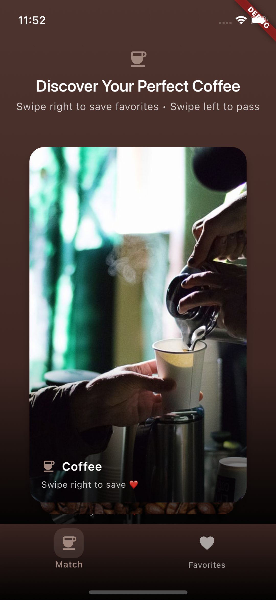

# VGV Coffee Matcher

Swipe left or right on your favorite coffee images!

## Getting Started

1. Clone the repository
2. Run `flutter pub get`
3. Run `flutter run`

## Features

- Swipe left or right on your favorite coffee images
- View your favorite coffee images in the favorites page, even when offline
- Remove images from your favorites collection
- Supported on iOS and Android

## Architecture

This repository follows a feature-first folder structure, with the following
structure:

- `lib/common/` - core functionality like routing, base App widget, etc.
- `lib/features/` - the features of the application
- `lib/services/` - common API and cache services
- `lib/main.dart` - the main entry point of the application
- `test/` - unit and widget tests

## Screenshots

